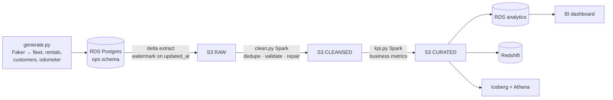

# DriveFlow — Car Rental Data Platform

**DriveFlow is an end-to-end data pipeline for a fictional car-rental company, built to learn the core AWS data-engineering stack hands-on — on real AWS, not emulators.**

The project simulates a rental business (a fleet of vehicles, rentals across branches, customers, and odometer telemetry), then runs that data through the full lifecycle a real data team owns: **generate → ingest → clean → model into KPIs → load into a warehouse → visualize**. Each stage is deliberately built on a different AWS service so that, by the end, I've used every important building block of an AWS data platform for a real reason — not from a tutorial.

It's a personal learning project. The data is fake (Faker-generated); the AWS services, the pipeline, and the engineering practices are real.

<p align="left">
  
  
  
  
  
</p>

---

## The goal: learn AWS data engineering, service by service

I'm using this project to get real, hands-on experience with the services that make up a modern AWS data platform. Rather than read about each one in isolation, I'm wiring them together into a single pipeline so I understand *how they connect* and *when to reach for which*.

| AWS service | Role in DriveFlow | What I'm learning |
|---|---|---|
| **S3** | Data lake — RAW / CLEANSED / CURATED / scripts zones | Partitioning, lifecycle, the zone/medallion pattern |
| **RDS (Postgres)** | Operational source (`ops`) + analytics target (`analytics`) | OLTP modeling, `COPY`/JDBC vs. driver loads, security groups |
| **AWS Glue** | Spark ETL (clean, KPI) + Python-shell jobs (generate, extract, load) | Serverless Spark, job types, DPU cost, Glue Data Catalog |
| **Step Functions** | Primary orchestrator of the pipeline | Serverless orchestration, state machines (ASL), service integrations |
| **Amazon MWAA / Airflow** | The same pipeline re-built to compare schedulers | DAGs, operators, backfills — and why not to leave it running |
| **Redshift Serverless** | Columnar MPP warehouse option | Distribution/sort keys, `COPY FROM S3`, MPP vs. row store |
| **Athena + Apache Iceberg** | Open-lakehouse query option | MERGE, time-travel, schema evolution, query-in-place |
| **EMR (Serverless / EC2)** | Scale-out Spark alternative to Glue | Cluster sizing, spot, YARN — and the Glue vs. EMR trade-off |
| **IAM** | Least-privilege roles for Glue + Step Functions | Scoping permissions to exactly what each job needs |
| **AWS Budgets + SNS** | $50 budget with tiered alerts | Cost monitoring and guardrails from day one |
| **Terraform** | Provisions *everything* | Modules, remote state, provider pinning, quality gates |

---

## What the pipeline actually does



1. **Generate** — a Faker-based generator writes one "business day" of operational data into RDS: vehicles, branches, customers, rentals, and odometer readings. It intentionally injects realistic mess — duplicate rentals, open rentals with null return dates, negative/decreasing odometer values, out-of-range fuel levels, malformed emails, and future dates — so the cleaning stage has something real to fix.
2. **Extract (delta)** — a watermark on `updated_at` pulls only new/changed rows since the last run into the S3 RAW zone as partitioned Parquet. Idempotent, so reruns and backfills never duplicate.
3. **Clean** — a Spark job dedupes on business keys, validates emails and dates, flags open rentals, drops negative odometer readings and enforces monotonic-increasing distance per vehicle, and nulls out-of-range fuel levels — writing a small data-quality report and failing the run if error rates exceed a threshold.
4. **KPIs** — a second Spark job turns cleansed data into the metrics a rental business actually cares about: **fleet utilization, revenue by branch and category, average km per rental, average rental duration, open-rental rate, and revenue per vehicle** — written to the CURATED zone.
5. **Load** — curated KPIs land in the RDS `analytics` schema (and, as learning exercises, in Redshift and in an Iceberg/Athena lakehouse) via idempotent delete-then-insert.
6. **Visualize** — a BI layer (QuickSight or Metabase) over the analytics schema: a vehicle-search view and a KPI dashboard.

The whole chain is run by a **Step Functions** state machine (`Generate → ExtractDelta → Clean → KPI → Load`), triggerable from the console with a `{"run_date": "..."}` input.

---

## How I'm building it: three passes over the same pipeline

To learn the *trade-offs* between services, the same job code and Terraform modules are deployed three ways — only the compute / orchestration / warehouse tier changes.

| | **Class A — MVP** | **Class B — Scale** | **Class C — Production** |
|---|---|---|---|
| Compute | Glue (Spark + Python-shell) | EMR Serverless / on-EC2 | hardened Class B |
| Orchestration | **Step Functions** | MWAA / Airflow (rehearsal) | CI/CD promoted |
| Warehouse | RDS `analytics` + Iceberg/Athena | Redshift Serverless | Multi-AZ + snapshots |
| Goal | prove the pipeline works | learn scale-out + MPP | learn DR + hardening |

**Class A is the target MVP** — everything green end-to-end before B or C. B and C are stretch/learning tiers, built ephemerally.

---

## Guardrails I set for myself

- **Real AWS, never local.** No LocalStack, no Docker Spark — iterate on tiny samples against real managed services so what I learn actually transfers.
- **Ephemeral & under $50/mo.** One `terraform apply` to stand up, test, then `terraform destroy` the same session; every run ends with `terraform state list` confirmed empty. A $50 AWS Budget with alerts at $20/$35/$45 exists before anything else.
- **No accidental cost sinks.** The warehouse load runs as a Glue **Python-shell + `psycopg2`** job outside the VPC against a locked-down public RDS — deliberately avoiding a NAT gateway (~$32/mo, alone enough to break the budget). Expensive services (MWAA, Redshift, EMR) are toggle-gated and default **off**.
- **Idempotency by default.** Per-day partitions + overwrite-by-partition + delete-then-insert loads → safe reruns and backfills.
- **Everything in Terraform.** Reusable modules, isolated remote state per environment (S3 + native lockfile, no DynamoDB), pinned providers, and quality gates (`fmt`, `tflint`, `tfsec`/`checkov`, `terraform-docs`).

---

## Repository layout

```
DriveFlow-Car-Rental-Pipeline/
├── global/bootstrap/       # one-time: creates the S3 remote-state bucket (local state)
├── modules/                # reusable building blocks (s3, iam_roles, glue, step_functions,
│                           #   rds, redshift, emr, mwaa, budget)
├── envs/                   # thin roots, one per class (class-a / class-b / class-c), isolated state
├── jobs/                   # generate · extract_delta · clean · kpi · load_warehouse
├── include/sql/            # ddl_ops.sql · ddl_analytics.sql
└── dags/                   # Airflow DAGs (Class B rehearsal only)
```

Every module follows the same contract — `main.tf`, `variables.tf`, `outputs.tf`, `versions.tf` (pinned providers), `README.md` — and never hardcodes names/regions/accounts. The `aws` provider is configured once per env root and inherited by the modules.

---

## Quickstart

> Prereqs: AWS CLI v2 (`lab28` profile), Terraform ≥1.10, `psql`, and the pre-commit toolchain. Region: `eu-central-1`.

```bash
# 1. One-time: create the remote-state bucket (runs on local state)
cd global/bootstrap && terraform init && terraform apply
#    → copy the `state_bucket` output into envs/class-a/backend.tf

# 2. Stand up the MVP
cd ../../envs/class-a
terraform init && terraform fmt && terraform validate
terraform plan            # free — run often
terraform apply           # deploy only when ready to test

# 3. Run the pipeline
aws stepfunctions start-execution --state-machine-arn <arn> \
  --input '{"run_date":"2026-06-29"}'

# 4. Verify, then always destroy
terraform destroy && terraform state list   # must be EMPTY
```

---

## Cost model (why it stays under $50)

| Resource | Setting | Cost at lab scale |
|---|---|---|
| S3 (4 zones) | few GB, `force_destroy=true` | ~$1/mo |
| Glue Spark (clean, kpi) | 2× G.1X, ~5-min runs | ~$7/mo |
| Glue Python-shell (generate, extract, load) | 0.0625 DPU | cents |
| Step Functions | standard workflow | ~$0 |
| RDS Postgres | `db.t3.micro`, Free Tier, SG → single IP | $0 (free tier) |
| Redshift Serverless *(toggle)* | auto-pause, deleted after | ~$5 / session |
| MWAA *(toggle)* | deploy → test → **destroy** only | ~$2–5 once |

**Typical month ≈ $10–15 routine, ~$20–25 with a Redshift + MWAA exercise — comfortably under $50.**

---

## Build status

- [x] **Foundation** — remote-state bootstrap (S3 + native lockfile), module scaffolding, pinned providers, class-a backend + provider config
- [ ] **Foundation wiring** — `envs/class-a/main.tf` wiring `s3` / `iam_roles` / `budget`; prove `init → plan → apply → destroy`
- [ ] **Class A (MVP)** — RDS source → watermarked extract → Spark clean/KPI → RDS load, orchestrated by Step Functions; Iceberg/Athena option; BI dashboard
- [ ] **Class B (Scale)** — EMR Serverless, Redshift Serverless, MWAA rehearsal
- [ ] **Class C (Production)** — `envs/prod`, Multi-AZ + DR drill, Secrets Manager, CloudWatch/SNS, CI plan-on-PR
- [ ] **ML layer** *(optional)* — rental risk & failure prediction chained after the KPI stage

<sub>Personal learning project · fictional Faker data · built to be reproducible for well under $50/month and destroyed after every session.</sub>
