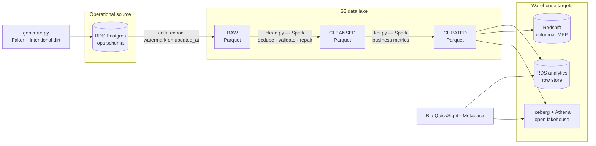

# DriveFlow — Car Rental Data Platform

> A production-shaped, **cost-capped ($50/mo)**, **fully ephemeral** data platform for a fictional car-rental company — built entirely on **real AWS** (no LocalStack, no emulators) and provisioned end-to-end with **modular Terraform**.
>
> Every environment stands up with one `terraform apply` and tears down to **zero billable resources** with one `terraform destroy`. The whole point: demonstrate senior data-engineering judgment — idempotency, cost control, IaC discipline, and warehouse trade-offs — not just "it runs."

<p align="left">
  
  
  
  
  
  
</p>

---

## Why this project exists

Most portfolio pipelines cheat in one of two ways: they run locally (so none of the real cloud complexity shows up), or they leave expensive infrastructure running (so nobody can actually reproduce them). DriveFlow refuses both.

It is a **real-AWS, deploy-test-destroy** platform that models the same pipeline **three different ways** — serverless, scale-out, and production-hardened — over one shared codebase, so the interesting engineering lives in the *decisions*, not the plumbing:

- **Idempotency by construction** — per-day partitions + delete-then-insert loads mean any run is safely repeatable and backfillable.
- **Cost as a first-class constraint** — an architecture deliberately engineered to avoid the silent budget-killers (NAT gateways, idle MWAA, un-paused Redshift).
- **IaC as the only source of truth** — remote state with native S3 locking, reusable modules, pinned providers, and automated quality gates (`fmt` / `tflint` / `tfsec` / `terraform-docs`).
- **Warehouse literacy** — the same curated data lands in a row store, a columnar MPP warehouse, and an open lakehouse, so the trade-offs are shown, not asserted.

---

## Architecture



**Orchestration** — a Step Functions state machine runs `Generate → ExtractDelta → Clean → KPI → Load` as the day-to-day driver (serverless, ~$0, console-triggerable). The **identical** logical DAG is re-implemented in **Airflow/MWAA** as a time-boxed study exercise to compare schedulers — MWAA is never left running.


---

## The three delivery classes

The same job code and the same Terraform modules power all three; only the compute / orchestration / warehouse tier changes. Expensive tiers are `count`-gated behind boolean toggles and default **off**.

| | **Class A — MVP** | **Class B — Scale** | **Class C — Production** |
|---|---|---|---|
| **Theme** | Serverless-first | Heavy processing | Hardened + DR |
| **Compute** | Glue (Spark + Python-shell) | EMR Serverless / EMR-on-EC2 | Class B, hardened |
| **Orchestration** | **Step Functions** | MWAA / Airflow (rehearsal) | CI/CD promoted |
| **Warehouse** | RDS `analytics` + Iceberg/Athena | Redshift Serverless | Multi-AZ + snapshots |
| **State root** | `envs/class-a` | `envs/class-b` | `envs/prod` |
| **Cost posture** | ~$10–15/mo routine | ephemeral bursts (~$5 each) | validated briefly / simulated |

> **Class A is the MVP — green end-to-end before B or C is touched.** B and C are learning/stretch tiers built ephemerally.

---

## Engineering decisions worth interviewing on

**No NAT gateway — on purpose.** The warehouse load runs as a Glue **Python-shell + `psycopg2`** job *outside* the VPC, hitting a locked-down publicly-accessible RDS (security group scoped to a single IP). This sidesteps a Glue VPC Connection + NAT gateway (~$32/mo) that would, by itself, blow the $50 budget. The Spark-JDBC alternative was evaluated and deliberately rejected for this reason.

**Idempotency everywhere.** Data is partitioned by `dt={run_date}` and written with overwrite-by-partition; warehouse loads use delete-then-insert per partition. Reruns and multi-day backfills produce zero duplicates — validated with a backfill drill.

**Data quality is enforced, not hoped for.** The generator injects realistic dirt — duplicate rentals, null returns, negative/decreasing odometer readings, out-of-range fuel levels, malformed emails, future dates. The cleansing job repairs each, and a **DQ gate fails the run** when null/dup rates exceed thresholds. Failing loudly is the senior behavior.

**Remote state, done right.** State lives in a versioned, encrypted, public-access-blocked S3 bucket with **native S3 locking** (`use_lockfile`, Terraform ≥1.10) — no DynamoDB table to provision or pay for. A one-time `global/bootstrap` root (the only local-state exception) creates the bucket; every env root consumes it under its own state key.

**Cost guardrails first.** A $50 AWS Budget with alerts at $20/$35/$45 is created *before* anything else; `default_tags` stamp every resource with `Project=driveflow` for budget filtering and one-command cleanup; every session ends with `terraform destroy` → `state list` confirmed empty.

**Warehouse comparison, not warehouse religion.** The same curated Parquet feeds **RDS (row)**, **Redshift Serverless (columnar MPP)**, and **Iceberg + Athena (open lakehouse)** — three loading patterns (`INSERT`, `COPY … FORMAT AS PARQUET`, `MERGE`/time-travel) evaluated side by side.

---

## Repository layout

```
DriveFlow-Car-Rental-Pipeline/
├── global/
│   └── bootstrap/          # one-time: creates the S3 remote-state bucket (local state)
├── modules/                # reusable, environment-agnostic building blocks
│   ├── s3/                 # raw / cleansed / curated / scripts buckets
│   ├── iam_roles/          # least-privilege Glue + Step Functions roles
│   ├── glue/               # generic job module (glueetl | pythonshell), reused via for_each
│   ├── step_functions/     # ASL state machine: generate → … → load
│   ├── rds/                # db.t3.micro Postgres, SG locked to one IP
│   ├── redshift/           # Redshift Serverless (toggle-gated)
│   ├── emr/                # EMR Serverless / on-EC2 (toggle-gated)
│   ├── mwaa/               # Airflow env (toggle-gated, cost-warned)
│   └── budget/             # AWS Budgets + SNS alerts
├── envs/                   # thin roots — one per delivery class, isolated state
│   ├── class-a/            # MVP: backend.tf · providers.tf · versions.tf · variables.tf
│   ├── class-b/
│   └── class-c/
├── jobs/                   # generate · extract_delta · clean · kpi · load_warehouse
├── include/sql/            # ddl_ops.sql · ddl_analytics.sql
└── dags/                   # Airflow DAGs (Class B rehearsal only)
```

**Module contract** — every module exposes the same files: `main.tf`, `variables.tf` (typed + validated), `outputs.tf`, `versions.tf` (pinned `required_providers`), `README.md`. Modules never hardcode names, regions, or accounts; the `provider` is configured **once** in each env root and inherited.

---

## Quickstart

> Prereqs: AWS CLI v2 with a `lab28` profile, Terraform ≥1.10, `psql`, and the pre-commit toolchain (`tflint`, `tfsec`/`checkov`, `terraform-docs`). Region: `eu-central-1`.

```bash
# 1. One-time: create the remote-state bucket (runs on local state)
cd global/bootstrap
terraform init && terraform apply
#    → copy the `state_bucket` output into envs/class-a/backend.tf

# 2. Stand up the MVP environment
cd ../../envs/class-a
terraform init          # configures the S3 backend + native lockfile
terraform fmt && terraform validate
terraform plan          # free — run it often
terraform apply         # deploy ONLY when ready to test

# 3. Run the pipeline
aws stepfunctions start-execution \
  --state-machine-arn <arn> \
  --input '{"run_date":"2026-06-29"}'

# 4. Verify, then destroy the same session
aws s3 ls s3://<curated-bucket>/curated/ --recursive
psql -h <rds-endpoint> -U admin -d driveflow -c 'select * from revenue_by_branch;'
terraform destroy
terraform state list    # must be EMPTY
```

---

## Cost model (why it stays under $50)

| Resource | Setting | Cost at lab scale |
|---|---|---|
| S3 (4 zones) | `force_destroy=true`, few GB | ~$1/mo |
| Glue Spark (clean, kpi) | 2× G.1X, autoscaling off, ~5-min runs | ~$7/mo (~100 runs) |
| Glue Python-shell (generate, extract, load) | 0.0625 DPU | cents |
| Step Functions | standard workflow | ~$0 |
| RDS Postgres | `db.t3.micro`, Free Tier, SG → single IP | $0 (free tier) |
| Redshift Serverless *(toggle)* | 4-RPU, auto-pause, deleted after | ~$5 / session |
| MWAA *(toggle)* | mw1.small — **deploy→test→destroy only** | ~$2–5 once |

**Typical month:** ~$10–15 routine, plus one MWAA and one Redshift exercise ≈ **~$20–25, comfortably under $50.**

---

## Roadmap / build status

- [x] **Foundation** — remote-state bootstrap (S3 + native lockfile), module scaffolding, pinned providers, class-a backend + provider config
- [ ] **Foundation wiring** — `envs/class-a/main.tf` wiring `s3` / `iam_roles` / `budget`; prove `init → plan → apply → destroy`
- [ ] **Class A (MVP)** — RDS ops source → watermarked delta extract → Spark clean/KPI → RDS `analytics` load, orchestrated by Step Functions; Iceberg + Athena option; BI dashboard
- [ ] **Class B (Scale)** — EMR Serverless, Redshift Serverless, MWAA rehearsal, Databricks Delta comparison
- [ ] **Class C (Production)** — `envs/prod`, Multi-AZ + DR drill, Secrets Manager, CloudWatch/SNS, CI plan-on-PR
- [ ] **ML layer** *(optional)* — rental risk & failure prediction chained after the KPI stage

---

## What this demonstrates

Data modeling across a realistic operational schema · idempotent incremental ingestion with watermarking · Spark cleansing and validation at scale · enforced data-quality gates · serverless orchestration and scheduler comparison · a three-way warehouse trade-off study · least-privilege IAM · and — throughout — Terraform good enough to hand to a team: reusable modules, isolated remote state, pinned versions, and automated quality gates.

<sub>Personal learning project. Fictional data (Faker-generated). Built to be reproducible for well under $50/month and destroyed after every session.</sub>
